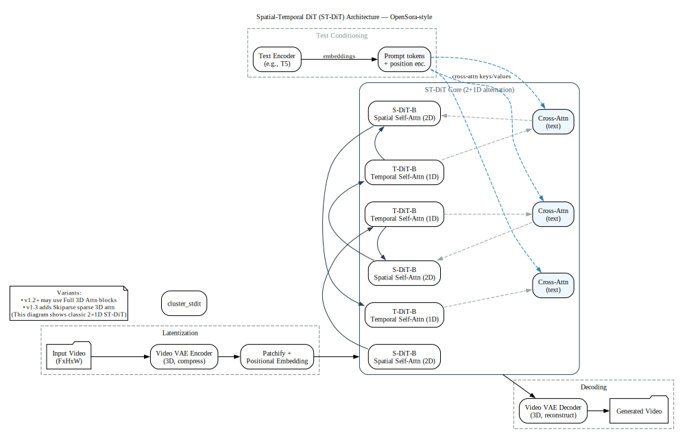
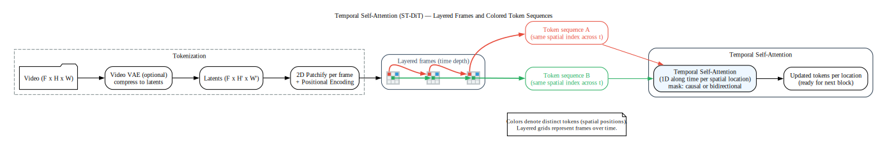
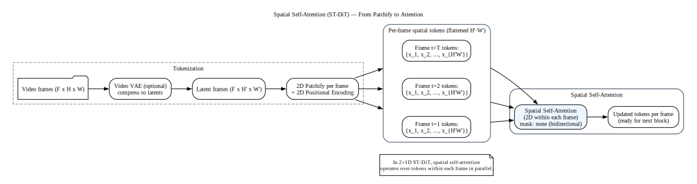
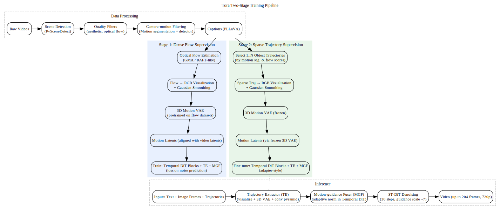
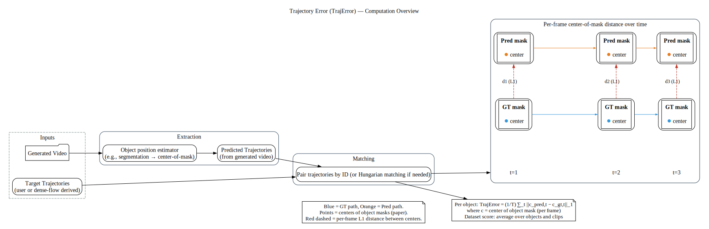

# Tora: Trajectory-oriented Diffusion Transformer for Video Generation — Summary

## Overview
- Goal: controllable video generation that precisely follows user-specified motion trajectories while scaling to long durations, various aspect ratios, and higher resolutions.
- Key idea: integrate trajectory guidance into a Diffusion Transformer (DiT) via motion patches produced by a 3D motion VAE and fused through adaptive normalization in temporal transformer blocks.

## Motivation
- UNet-based video diffusion methods struggle to scale to longer videos and flexible resolutions; motion control degrades with sequence length (blur, drift, deformation).
- DiT-based foundations (e.g., OpenSora) scale well but lack explicit motion control.

## Architecture
- Base: Spatial-Temporal DiT (OpenSora v1.2). Tokens come from a video autoencoder (spatiotemporal compression) then patchification.
- Trajectory Extractor (TE):
	- Input: sparse user trajectories or dense optical flow-derived trajectories.
	- Convert displacements to flow-visualized RGB maps; apply Gaussian smoothing.
	- 3D motion VAE compresses to motion latents aligned with video latent space (8× spatial, 4× temporal downsampling).
	- Lightweight stacked convs produce multi-level spacetime motion patches {f_i} matching DiT block hierarchy.
- Motion-guidance Fuser (MGF):
	- Injects motion patches into ST-DiT blocks. Ablated variants: extra channel concat, cross-attention, adaptive norm.
	- Best: adaptive normalization (learned scale/shift) inside Temporal DiT blocks; identity-initialized for stability.

### ST-DiT (OpenSora-style) overview

This diagram illustrates the classic 2+1D alternation used by OpenSora’s ST-DiT: spatial self-attention blocks interleaved with temporal self-attention blocks, with cross-attention to text after temporal blocks. OpenSora v1.2 introduced full 3D attention, and v1.3 adds Skiparse sparse 3D attention; this figure abstracts the traditional ST-DiT for clarity.

Source of diagram: [README/st-dit-architecture.dot](README/st-dit-architecture.dot)

#### References for this graphic

- Open-Sora Plan (v1.2 → 3D; v1.3 Skiparse): “In version 1.2, we start to introduce Full 3D Attention instead of 2+1D Attention… we propose a novel sparse attention mechanism… The 2+1D Attention … calculates frame interactions only along the temporal dimension.”
	https://arxiv.org/html/2412.00131v1
- Open-Sora v1.0 blog (STDiT 2+1D overview): “STDiT … uses a serial approach to superimpose a 1D temporal attention module on a 2D spatial attention module… After the temporal attention module, the cross-attention module is used to align the semantics of the text.”
	https://company.hpc-ai.com/blog/open-sora-v1.0
- DiT (backbone): “We train latent diffusion models … replacing the commonly-used U-Net backbone with a transformer that operates on latent patches.”
	https://arxiv.org/abs/2212.09748

### Temporal self-attention: patchify to tokens to attention

The figure below shows how frames are patchified into per-frame tokens, grouped by spatial index into sequences along time, then fed into a Temporal Self-Attention block (run in parallel for each spatial location in 2+1D ST-DiT).

Source of diagram: [README/temporal-attn.dot](README/temporal-attn.dot)

#### References for this graphic

- Open-Sora Plan Report v1.3.0 (2+1D alternation): “In the 2N Block, attention operates over the (H,W) dimensions… In the 2N+1 Block, attention operates along the (T) dimension…”
	https://github.com/PKU-YuanGroup/Open-Sora-Plan/blob/main/docs/Report-v1.3.0.md

### Spatial self-attention: per-frame token attention

This figure shows how per-frame tokens attend within the same frame (2D spatial attention), typically bidirectional and executed in parallel for each frame in 2+1D ST-DiT.

Source of diagram: [README/spatial-attn.dot](README/spatial-attn.dot)

#### References for this graphic

- Open-Sora Plan Report v1.3.0 (2+1D alternation): “In the 2N Block, attention operates over the (H,W) dimensions… In the 2N+1 Block, attention operates along the (T) dimension…”
	https://github.com/PKU-YuanGroup/Open-Sora-Plan/blob/main/docs/Report-v1.3.0.md

## Training and Data
- Data pipeline: scene splitting, quality filters (aesthetic, optical flow), camera-motion filtering with motion segmentation + camera detector; captions via PLLAVA; prompt refinement with GPT-4o at inference.
- Two-stage motion supervision:
	1) Train with dense optical flow to learn rich motion.
	2) Fine-tune with sparse trajectories (1–N objects), smoothed with Gaussian.
- Adapter-like strategy: freeze most of DiT, train temporal blocks + TE + MGF. 3D VAE pre-trained on flow datasets, then frozen.

### Two-stage training in detail

1) Stage 1 — Dense optical flow supervision
- Objective: teach the model strong generic motion priors and stabilize motion-patch alignment with DiT tokens.
- Signals: dense optical flow estimated per frame pair; converted to RGB via flow visualization; Gaussian smoothing mitigates scatter/noise.
- Compression: a 3D motion VAE (pretrained on optical-flow datasets) encodes the flow-RGB into motion latents that match the video latent space (same downsampling factors as the video VAE).
- Injection: multi-level motion patches are produced by stacked lightweight convs and injected through adaptive normalization inside Temporal DiT blocks (identity-initialized scale/shift for stability).
- Training scope: adapter-style — train temporal DiT blocks, TE, and MGF; keep the rest largely frozen to retain base generative knowledge.

2) Stage 2 — Sparse trajectory supervision
- Objective: adapt from dense flow to user-friendly sparse trajectories and improve controllability for object/camera motion.
- Trajectory source: randomly sample 1..N object tracks guided by motion segmentation and flow scores; Gaussian smoothing densifies sparse points.
- Reuse compression: the same frozen 3D motion VAE maps trajectory-RGB to motion latents, ensuring latent-space consistency with Stage 1.
- Injection and scope: same adaptive-norm fusion in Temporal DiT; fine-tune temporal blocks, TE, and MGF.

Diagram

Source of diagram: [README/two-stage-training.dot](README/two-stage-training.dot)

## Results
- Settings: 16/64/128 frames at 512²; also up to 204 frames and 720p demonstrated.
- Metrics: FVD (↓), CLIPSIM (↑), Trajectory Error (↓). Human/extra metrics in appendix: mIoU, AP50.

Trajectory Error (TrajError) computation overview:

Source of diagram: [README/traj-error.dot](README/traj-error.dot)
 
### Metric definition (from paper)

> For assessing motion controllability, we utilize the Trajectory Error (TrajError) metric, which calculates the average L1 distance between the generated and predefined trajectories.

Source: `papers/tora/sec/s4_Experiments.tex` (Experiments — Metrics)
 
### Ground-truth trajectory points (from paper)

> Each center point of the annotated object masks is treated as a trajectory point. The number of trajectories in the tested video matches the number of annotated objects.

Source: `papers/tora/sec/s6_Supplementary_Material.tex` (Evaluation dataset)
- Compared to UNet-based (VideoComposer, DragNUWA, MotionCtrl, etc.): Tora has lower TrajError and better FVD, with robustness growing at longer sequences.
- Compared to DiT baselines: OpenSora has strong visuals but high TrajError; adding Tora achieves motion control while maintaining or slightly improving visual quality.
- Fusion and compression ablations: adaptive norm and 3D motion VAE outperform concat/average pooling alternatives.
- Scaling: motion modules transfer to larger DiT (e.g., CogVideoX 2B/5B), improving controllability with model/data scale.

## Capabilities
- Inputs: text-only, image-to-video, start/end frames, multiple trajectories, camera/object control.
- Outputs: longer clips, varied AR/resolutions, improved temporal coherence and physically plausible motion.

## Takeaways
- Trajectory-to-motion-patch alignment in DiT’s latent space is key for stable, scalable motion control.
- Adaptive norm in temporal blocks is an effective and compute-friendly injection mechanism.
- Two-stage supervision bridges dense flow learning and user-friendly sparse trajectories, enabling flexible control.

## Links
- Project: https://ali-videoai.github.io/tora_video/
- Code: https://github.com/alibaba/Tora