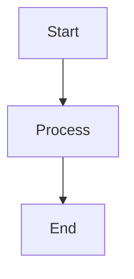
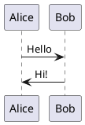

# Introduction to Slidev

Slidev (slide + dev, **/slaɪdɪv/**) is a web-based presentation maker and presenter designed for developers. It allows you to create pixel-perfect presentations using Markdown and modern web technologies.

## What is Slidev?

Slidev is an open-source project that combines the simplicity of Markdown with the power of Vue.js, Vite, and other modern web technologies. It's specifically designed for developers who want to focus on content while having access to rich interactive features and beautiful designs.

### Key Features

- **Markdown-based**: Write slides using familiar Markdown syntax
- **Developer-friendly**: Code highlighting, live coding, and interactive demos
- **Theme system**: Rich collection of themes and easy customization
- **Modern tech stack**: Built on Vue 3, Vite, UnoCSS, and other cutting-edge tools
- **Export options**: PDF, PPTX, PNG, or static web application
- **Presenter mode**: Built-in presenter view with notes and controls

## Installation & Setup

### Prerequisites

- Node.js >= 18.0

### Create a New Project

```bash
# Using pnpm (recommended)
pnpm create slidev

# Using npm
npm init slidev@latest

# Using yarn
yarn create slidev

# Using bun
bun create slidev
```

### Global CLI Installation (for single files)

```bash
# Install globally
pnpm i -g @slidev/cli
npm i -g @slidev/cli

# Run with a single markdown file
slidev slides.md
```

## Basic Usage Pattern

### 1. Project Structure

After creating a project, you'll have:

```
my-slidev/
├── slides.md          # Main slides file
├── package.json       # Dependencies and scripts
├── components/        # Custom Vue components
├── layouts/           # Custom layouts
├── public/           # Static assets
└── style.css         # Global styles
```

### 2. Basic Slide Structure

```markdown
---
# Headmatter (first slide configuration - applies to entire deck)
theme: seriph
title: My Presentation
---

# Slide 1: Title Slide

Welcome to my presentation!

---

# Slide 2: Content

- Point 1
- Point 2
- Point 3

---
layout: two-cols
---

# Slide 3: Two Columns

Left column content

::right::

Right column content

---

# Slide 4: Code Example

```typescript
function greet(name: string) {
  console.log(`Hello, ${name}!`)
}
```
```

### 3. Slide Separators

Use `---` (three dashes) with new lines to separate slides:

```markdown
# Slide 1
Content here

---

# Slide 2
More content

---

# Slide 3
Final slide
```

### 4. Frontmatter Configuration

Each slide can have its own configuration:

```markdown
---
layout: center
background: /background.jpg
class: text-white
---

# Centered Slide
With custom background
```

## Running & Development

### Development Server

```bash
# Start development server
slidev
# or
npm run dev
pnpm dev
```

This opens:
- Main presentation: `http://localhost:3030`
- Presenter mode: `http://localhost:3030/presenter`
- Overview: `http://localhost:3030/overview`

### Available Commands

```bash
# Development
slidev                    # Start dev server
slidev --open            # Start and open browser
slidev --port 3031       # Custom port

# Export
slidev export            # Export to PDF
slidev export --format pptx  # Export to PowerPoint
slidev export --format png   # Export to images

# Build
slidev build            # Build static website
slidev format           # Format slides

# Help
slidev --help           # Show all options
```

## Built-in Layouts

Slidev provides many built-in layouts:

```markdown
---
layout: cover
---
# Cover slide

---
layout: center
---
# Centered content

---
layout: two-cols
---
# Left column
::right::
# Right column

---
layout: image-left
image: /path/to/image.jpg
---
# Content with image

---
layout: quote
---
"This is a quote"

---
layout: fact
---
# 100%
Big fact or number
```

## Code Highlighting

Slidev has excellent code support:

````markdown
```typescript {1,3-4|2|5}
function calculate(a: number, b: number) {
  const sum = a + b
  const product = a * b
  const difference = a - b
  return { sum, product, difference }
}
```
````

Features:
- Syntax highlighting via Shiki
- Line highlighting
- Step-by-step revelation
- Monaco editor integration
- Live code execution

## Themes & Customization

### Using Themes

```markdown
---
theme: seriph
# or theme: apple-basic, academic, etc.
---
```

### Popular Themes
- `seriph` - Clean and elegant
- `apple-basic` - Apple Keynote style
- `academic` - Academic presentations
- `bricks` - Minimalist design
- `purplin` - Purple gradient theme

### Custom Styling

```markdown
---
layout: default
---

# Styled Content

<div class="text-red-500 text-xl font-bold">
  Custom styled text
</div>

<style>
.slidev-page {
  background: linear-gradient(45deg, #ff6b6b, #4ecdc4);
}
</style>
```

## Advanced Features

### Interactive Components

```markdown
<Tweet id="1234567890" />

<YouTube id="dQw4w9WgXcQ" />

<LightBoard 
  width="400" 
  height="300" 
  color="#ff6b6b"
/>
```

### Diagrams

```markdown



```

### Math Formulas

```markdown
Inline math: $x = y + z$

Block math:
$$
\int_{-\infty}^{\infty} e^{-x^2} dx = \sqrt{\pi}
$$
```

## Building & Deployment

### Build for Production

```bash
slidev build
```

Outputs to `dist/` directory as a static website.

### Export Options

```bash
# PDF export
slidev export

# PowerPoint export  
slidev export --format pptx

# PNG images
slidev export --format png

# With custom range
slidev export --range 1,3-5,8
```

### Deployment

Deploy the `dist/` folder to any static hosting:

- Netlify
- Vercel
- GitHub Pages
- Firebase Hosting

## VS Code Integration

Install the official Slidev VS Code extension for:
- Slide preview
- Quick navigation
- Syntax highlighting
- Slide management

## Tips & Best Practices

1. **Organization**: Split large presentations using slide imports
2. **Assets**: Place images in `public/` folder
3. **Components**: Create reusable Vue components in `components/`
4. **Styling**: Use UnoCSS classes for quick styling
5. **Performance**: Optimize images and limit animations
6. **Presenter Notes**: Use HTML comments for speaker notes

## Resources

- **Official Documentation**: https://sli.dev/
- **Theme Gallery**: https://sli.dev/resources/theme-gallery
- **Examples**: https://sli.dev/resources/showcases
- **Discord Community**: https://chat.sli.dev/
- **GitHub Repository**: https://github.com/slidevjs/slidev

## Common Use Cases

- Technical presentations and demos
- Code walkthroughs and tutorials
- Academic presentations
- Conference talks
- Workshop materials
- Interactive documentation

Slidev combines the best of both worlds: the simplicity of Markdown for content creation and the power of modern web technologies for rich, interactive presentations.
